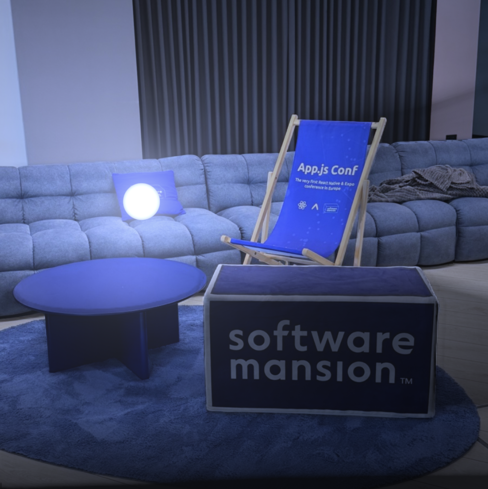

# Monocular Light Injection

A standalone build of the **Monocular Light Injection** [TypeGPU](https://typegpu.com)
example: it runs a small depth-estimation model entirely on the GPU (via WebGPU
compute shaders written in TypeScript) against your camera or a photo, then
relights the scene in real time around a light you can drag around.



This repository extracts the example from
[`software-mansion/TypeGPU`](https://github.com/software-mansion/TypeGPU)
(`apps/typegpu-docs/src/examples/image-processing/monocular-light-injection`)
into its own minimal Vite project so it can run outside of the TypeGPU docs
site.

## Running it

Requires a browser with WebGPU support (recent Chrome, Edge, or Firefox
Nightly with the flag enabled).

```sh
npm install
npm run dev
```

Then open the printed local URL. On first load you'll be asked to pick a
source (your camera or a bundled demo photo) and a model size — larger models
are more accurate but slower to download and run.

```sh
npm run build     # type-check + production build to dist/
npm run preview   # serve the production build locally
```

## How it works

- `src/example/` — the example itself: camera capture, an ONNX-free WebGPU
  inference pipeline for a depth model (im2col/Winograd convolutions,
  selective-scan kernels, etc. under `inference/`), and a relighting renderer
  that shades the scene from the estimated depth/normals.
- `src/common/defineControls.ts` — a small typed helper the example uses to
  describe its on-screen controls (sliders, color picker, view/camera
  selectors).
- `src/main.ts` + `index.html` — the app shell for this standalone repo,
  replacing the React/Tailwind control panel the TypeGPU docs site provides.
  It gates on an actual WebGPU adapter before loading anything heavy, renders
  the control dock (sliders with live readouts, segmented view switcher, color
  swatch), and adds keyboard shortcuts, toasts and first-run hints.

  Two details worth knowing before editing it: the example binds to a fixed set
  of DOM selectors (`.status`, `.chooser`, `.source-row`, `.start-button`, …)
  which `index.html` must keep intact, and `.status`/`.chooser` are toggled via
  the `hidden` *property* — so the `[hidden]` CSS guards are load-bearing. The
  renderer also sizes the canvas backing store itself to a square every frame,
  which is why the viewport is locked to a 1:1 CSS box.
- Model weights are **not** stored in this repo — they're fetched at runtime
  from a hosted, revision-pinned bundle (see `src/example/model-store.ts`).

## Attribution & licensing

- The example source code is copied from TypeGPU, which is MIT licensed by
  Software Mansion S.A. — see [`LICENSE`](./LICENSE).
- `public/assets/depthart/demo.jpg` is a bundled demo photo, and the depth
  model is a converted checkpoint of **DepthART**
  ([xuefeng-cvr/DepthART](https://github.com/xuefeng-cvr/DepthART)), both
  distributed under Apache License 2.0 — see
  [`public/assets/depthart/`](./public/assets/depthart/) for the license and
  attribution notices.

This project is not affiliated with Software Mansion beyond reusing their
open-source example under its license; all credit for the original example,
runtime, and model conversion goes to the TypeGPU project.
